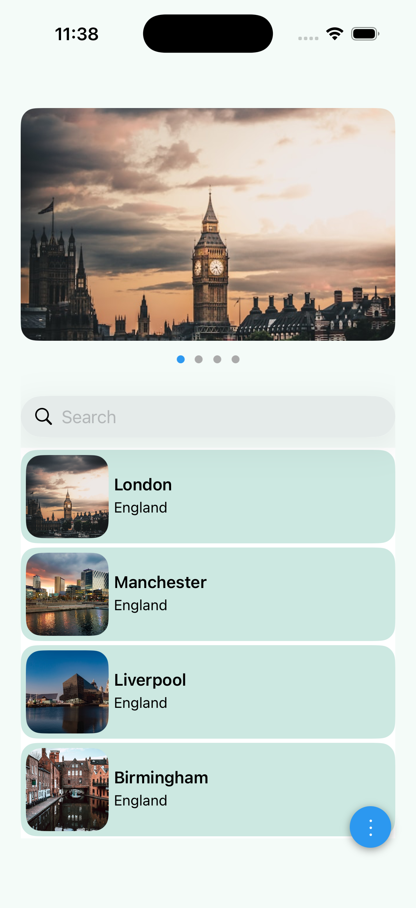
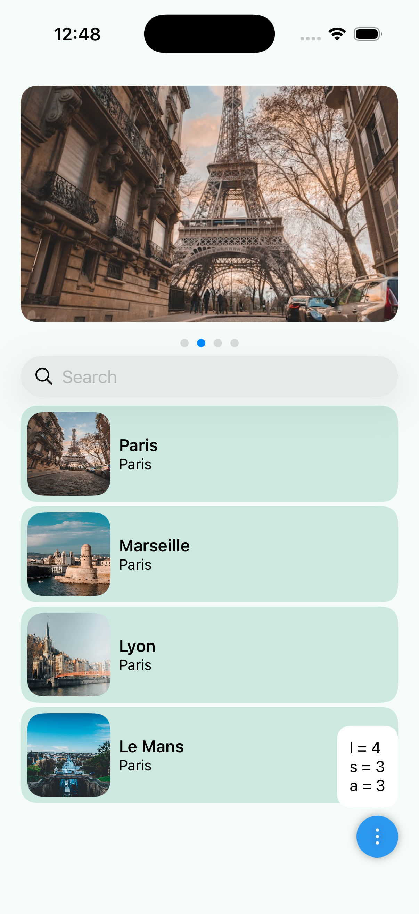

# iOS Test Assignment

## Overview

This project is an implementation of the given test assignment.

To complete the task, it was necessary to fulfill the following points:

* Images carousel: when user swipe left or right, list content should change accordingly. The images carousel can handle any number of images.
* The list: when user scrolls up the whole page should scroll with it. The list can handle any number of items. P.S. images and list content can be local or loaded from the internet.
* Search: Search bar should pin top when it reaches screen top. When user enter text, it should filter the labels in the list based on the user input. 
* Floating action button should show a nice bottom sheet dialog that contain a small statistic that consist of the count of items for each page and show the top 3 occurrence character in the list. i.e listOf(“apple”, “banana” , “orange”, “blueberry”)
    List 1 (4 items)
    a = 5
    e = 4
    r = 3
* Don’t use third party libraries
* Implement the requirements using both SwiftUI & UIKit, each implementation should be pushed to a separate git branch.

All items from the list were completed.

---

The application is built using the **MVVM (Model–View–ViewModel)** architecture pattern to ensure clear separation of concerns, maintainability, and scalability.

---

## Architecture

The project follows the **MVVM** architectural pattern:
- **Model** — data structures and business logic  
- **View** — UI layer  
- **ViewModel** — presentation logic and data binding between Model and View  

---

## Project Structure

The project is organized into the following folders:

### 📂 Networking
Contains the networking layer.

### 📂 Domain
Contains core data models used throughout the application.

### 📂 Scenes
Screen implementations, including:
- Views  
- ViewModels  
- Screen-specific logic  

### 📂 Elements
Reusable UI components and custom interface elements.

### 📂 Utilities
Helper classes, extensions, and shared utility logic.

### 📂 Resources
Contains:
- Assets  
- Color definitions  
- Localized strings  

---

## What to improve

Considering the time constraints, it was decided to make the images local.

To enable loading images from the internet, a separate layer responsible for downloading could be added, which would use a caching layer. In that case, images in the cache would be stored as files with a required limit on the amount of storage space they occupy.

## Branches

The project includes two separate implementations:

- `developUIKit` — UIKit-based implementation  
- `developSwiftUI` — SwiftUI-based implementation  

Please switch to the appropriate branch depending on the version you would like to review.

## Screenshots

  
  

